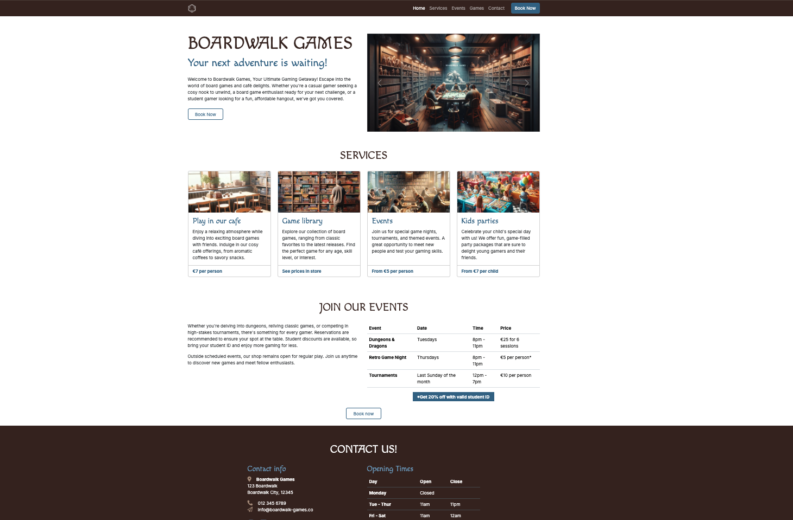

# Boardwalk Games

## Introduction 

Boardwalk Games is a coding module project developed as part of the Code Institute Full Stack Software Development For The AI Augmented Developer Bootcamp, consisting of learning outcomes that utilise HTML5, CSS3, Bootstrap 5.3.3, Javascript and GitHub Copilot.

The LIVE PROJECT can found here: <a href="https://gerbil1511.github.io/boardwalk-games/" target="_blank">Boardwalk Games</a>

## Credits

### Code

Project and primary learning supplied by [Code Institute](https://codeinstitute.net/ie/) 
